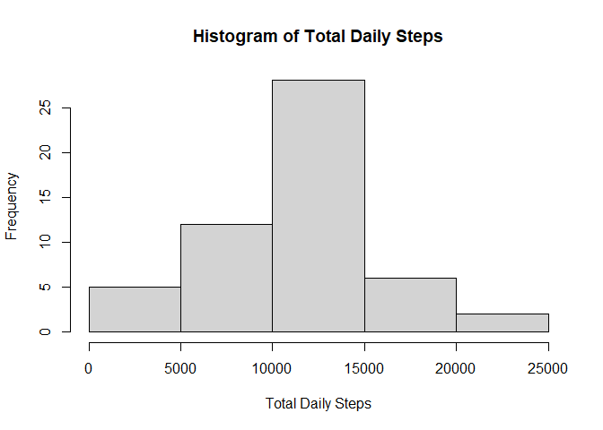
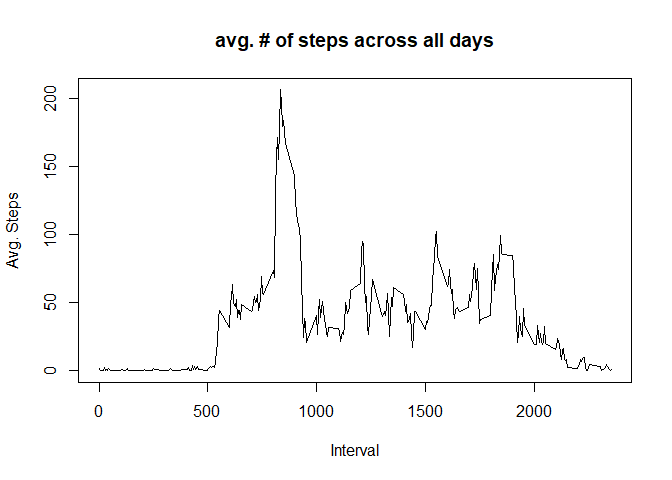
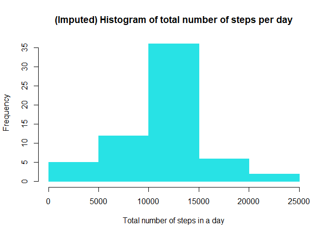
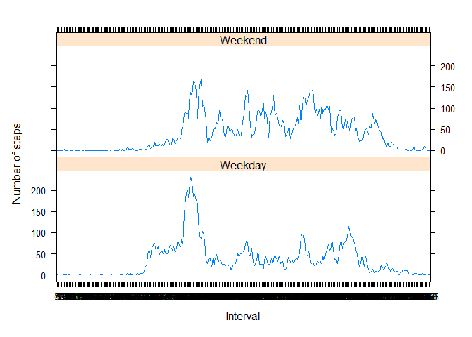

Library Packages:  

```r
library(dplyr)
library(lattice)
```

```r
inline_hook <- function(x) {
  if (is.numeric(x)) {
    format(x, digits = 2)
  } else x
}
##function to fix the numeric values from printing in scientific notation
knitr::knit_hooks$set(inline = inline_hook)
```
### Loading and reprocessing the data ###    
  1. Load the data    
  2. Process/transform the data   


```r
#1#load raw data from zipped activity file
data_raw <- read.csv(unzip(zipfile="activity.zip",files =  "activity.csv"))

#2#reformat/transform raw data to better analyze data file
data <- mutate(data_raw, date = as.Date(data_raw$date),
                         steps = as.numeric(data_raw$steps))
```
### What is average total number of steps taken per day? ###  
Create a histogram of the total number of steps:  
  - For this part of the assignment, you can ignore the missing values in the dataset.  
    1. calculate the total number of steps taken per day  

```r
#remove NA values from raw data
data1 <- na.omit(data)
#1#
daily_steps <- aggregate(steps ~ date, data = data1, sum)
#2# 
hist(daily_steps$steps, main="Histogram of Total Daily Steps", 
     xlab="Total Daily Steps")
```

<!-- -->

### Calculate the mean and median values of steps per day ###  

```r
mean1 <- round(mean(daily_steps$steps),digits = 2)
median1 <- round(median(daily_steps$steps),digits = 2)
```
For the number of steps taken each day the mean is **10766** and the median is **10765**

### What is the average daily activity pattern? ###  
  1. Make a time series plot (i.e. type = "l") of the 5-minute interval (x-axis) and the average number of steps taken, averaged across all days (y-axis)  
  

```r
interval <- aggregate(steps ~ interval, data = data1, mean)

plot(interval$interval, interval$steps, type = "l", col=1,
     main = "avg. # of steps across all days",
     xlab = "Interval",
     ylab = "Avg. Steps")
```

<!-- -->

  2. Which 5-minute interval, on average across all the days in the dataset, contains the maximum number of steps?  

```r
max_row <- which.max(interval$steps)

interval[max_row, ]
```

```
##     interval    steps
## 104      835 206.1698
```

### Imputing missing values ###  
Note that there are a number of days/intervals where there are missing values (coded as NA). The presence of missing days may introduce bias into some calculations or summaries of the data.  

  1. Calculate and report the total number of missing values in the dataset (i.e. the total number of rows with NAs)  

```r
data_na <- data[!complete.cases(data),]

#count rows
nrow(data_na)
```

```
## [1] 2304
```

  2. Devise a strategy for filling in all of the missing values in the dataset. The strategy does not need to be sophisticated. For example, you could use the mean/median for that day, or the mean for that 5-minute interval, etc.  

**Strategy:** Since we have the average steps per interval, we can fill in the missing NA values with the values from the table 'interval'. This strategy should keep the mean and median relatively the same since we are filling in the missing values with the data's overall averages by interval.   

  3. Create a new dataset that is equal to the original dataset but with the missing data filled in.  


```r
new_data <- data
##this for loop uses the interval data.frame as a lookup table to fill in NA values related to the specific interval.
for(i in 1:nrow(new_data)){
  if(is.na(new_data$steps[i])){
    interval_val <- new_data$interval[i]
    row_id <- which(interval$interval == interval_val)
    steps_val <- interval$steps[row_id]
    new_data$steps[i] <- steps_val
  }
}
```


  4. Make a histogram of the total number of steps taken each day and Calculate and report the mean and median total number of steps taken per day. Do these values differ from the estimates from the first part of the assignment? What is the impact of imputing missing data on the estimates of the total daily number of steps?  

```r
# aggregate steps as per date to get total number of steps in a day
inserted <- aggregate(steps ~ date, new_data, sum)
# create histogram of total number of steps in a day
hist(inserted$steps, col=5, border = 5, main="(Imputed) Histogram of total number of steps per day", xlab="Total number of steps in a day")
```

<!-- -->

```r
mean2 <- mean(inserted$steps)
median2 <- median(inserted$steps)
```
For the number of steps taken each day the new mean is **10766** and the new median is **10766**. This is a minimal difference in the previous mean and median calculated above.

###  Are there differences in activity patterns between weekdays and weekends? ###  
For this part the weekdays() function may be of some help here. Use the dataset with the filled-in missing values for this part.  


Create a new factor variable in the dataset with two levels -- "weekday" and "weekend" indicating whether a given date is a weekday or weekend day.  

```r
day <- weekdays(as.Date(new_data$date))
daylevel <- vector()
for (i in 1:nrow(new_data)) {
  if (day[i] == "Saturday") {
    daylevel[i] <- "Weekend"
  } else if (day[i] == "Sunday") {
    daylevel[i] <- "Weekend"
  } else {
    daylevel[i] <- "Weekday"
  }
}
new_data$daylevel <- daylevel
new_data$daylevel <- factor(new_data$daylevel)

stepsByDay <- aggregate(steps ~ interval + daylevel, data = new_data, mean)
names(stepsByDay) <- c("interval", "daylevel", "steps")
stepsByDay$interval <- as.factor(stepsByDay$interval)
```

Make a panel plot containing a time series plot (i.e. type = "l") of the 5-minute interval (x-axis) and the average number of steps taken, averaged across all weekday days or weekend days (y-axis). The plot should look something like the following, which was created using simulated data:  

```r
# make the panel plot for weekdays and weekends

xyplot(steps ~ interval | daylevel, stepsByDay, type = "l", layout = c(1, 2), 
       xlab = "Interval", ylab = "Number of steps")
```

<!-- -->

